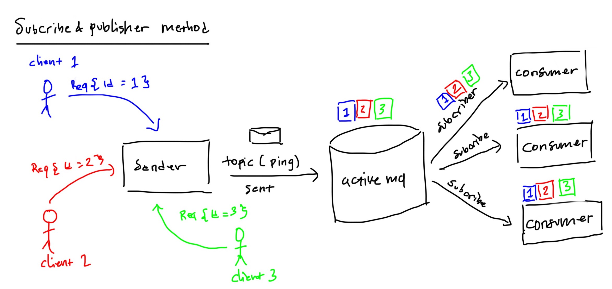

# Topic JmsTemplate

run the application:

```bash
cd topic-example

mvn clean spring-boot:run
```

send message:

```bash
curl -X POST \
  http://localhost:9090/message/send \
  -H 'Cache-Control: no-cache' \
  -H 'Content-Type: application/json' \
  -d ' {
	        "value": "message to send",
	        "data" : "addon message"
        }'
```

## Arsitektur application

